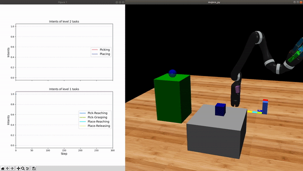
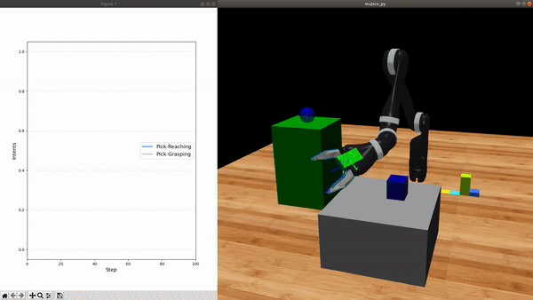
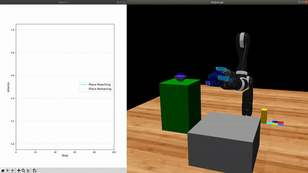

# mujoco_jaco

Please clone this repo along with the modified stable-baselines and abr_control repo with the following command

```bash
git clone https://github.com/TMmichi/mujoco_jaco.git
git clone https://github.com/TMmichi/stable-baselines.git
git clone https://github.com/TMmichi/abr_control.git
```

## Installation

### Mujoco

------
From abr_control:\
If you would like to use the Mujoco API you will need to install a forked version of [mujoco-py](https://github.com/studywolf/mujoco-py/) with hooks for exitting out of simulations with the ESC key. To use the mujoco API, make sure you are in your anaconda environment and run:

```bash
git clone https://github.com/studywolf/mujoco-py.git
cd mujoco-py
pip install -e .
cd ..
```

### Dependencies
------
After installing mujoco-py, setup both stable-baselines and abr_control package from the maintainer's repo.
```bash
cd stable-baselines
pip install -e .
cd ..
cd abr_control
pip install -e .
cd ..
```

------
Install additional requirements via:

```bash
cd mujoco_jaco
pip install -r requirements.txt
```

You're all set to go.

#### Note

If you get `No matching distribution found` error for tensorflow-gpu==1.15.0, you should upgrade your pip version to the latest one.
Also, if you're on MacOS, tensorflow-gpu is not available. Please install it with tensorflow==1.15.0
You'll need a CUDA and CuDNN installed in your machine.

### Pyspacenav

Python API for 3D Spacenav can be found [here](https://github.com/mastersign/pyspacenav)

## Example

### Training

It is assumed that you have one or more pretrained primitives to be fused. No matter the primitives are trained from the vanilla stable-baselines or a HPC module, both share the same implementation scheme. 

### Testing
```bash
./main.sh
```

## Results

### Pick and Place


### Picking


### Placing
